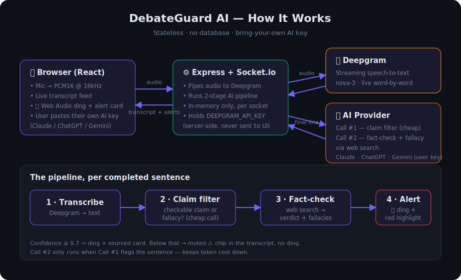

# 🎙️ DebateGuard AI

Real-time debate fact-checker and logical fallacy detector. When someone says something factually wrong or uses a logical fallacy during a debate, the app plays a **ding** and instantly shows the correct fact with a source.

**No database. No auth. Everything is stateless** — React state on the frontend, in-memory maps on the Express server. End the session and it all resets.

## Architecture



## How it works

```
🎤 Browser mic → Socket.io (PCM16 @ 16 kHz) → Express server
   → Deepgram streaming WebSocket (live word-by-word transcription)
   → on each final utterance:
       call #1 — fast scan: checkable claim? logical fallacy? (no web search)
                 ↳ fallacies alert INSTANTLY — they don't need the web
       call #2 — web-search fact-check, only if the claim is checkable
   → Socket.io "alert:trigger" → 🔔 ding (Web Audio API) + sourced correction card
```

The two-stage pipeline keeps things fast and cheap: fallacy alerts fire within seconds straight from the scan, and the slower web-search call only runs for verifiable factual claims. Alerts with confidence ≥ 0.7 fire the ding and card; lower-confidence flags show a muted ⚠️ chip in the transcript only.

## Bring your own AI key

Each user connects **their own** AI account on the session screen — no AI key is configured on the server:

| Provider | Models used | Web search for fact-checks |
|---|---|---|
| **Claude** (Anthropic) | `claude-haiku-4-5` (scan) + `claude-sonnet-5` (fact-check) | ✅ `web_search` tool |
| **ChatGPT** (OpenAI) | `gpt-4o-mini` + `gpt-4o-mini-search-preview` | ✅ (falls back to no-search if unavailable) |
| **Gemini** (Google) | `gemini-flash-latest` | ✅ Google Search grounding (falls back if unavailable) |

The key is kept in the browser's `localStorage` for convenience, sent to your DebateGuard server with `session:start`, held in memory for that session only, and never logged or written to disk.

## Stack

- **Frontend:** React 18 + Vite + Tailwind CSS v4, `socket.io-client`, Web Audio API
- **Backend:** Node.js + Express + Socket.io
- **Speech-to-text:** Deepgram streaming (`nova-3`) — the transcript renders as one flowing paragraph, no speaker labels
- **AI:** user-supplied key for Claude, OpenAI, or Gemini

## Setup

Requires Node 18+. The server needs one API key:

- **Deepgram** (speech-to-text) → `DEEPGRAM_API_KEY`. Get it free: sign up at [console.deepgram.com](https://console.deepgram.com/signup), then **API Keys → Create a New API Key** — new accounts include free credit, no card required. Copy the key into `.env`.

(The AI key for fact-checking is entered by each user in the app UI — you don't configure it on the server.)

```bash
# 1. install root tooling + both apps
npm install
npm run setup

# 2. configure the Deepgram key
cp .env.example .env   # then paste your Deepgram key into .env

# 3. run (server on :5000, client on :5173)
npm run dev
```

Open http://localhost:5173, click **Start a Session**, pick your AI provider, paste your API key, allow mic access, and start arguing.

> Chrome or Edge 90+ recommended (mic capture + Web Audio API).

## Pages

| Route | What it is |
|---|---|
| `/` | Landing — pitch + Start a Session |
| `/session` | Main screen — live transcript (60%) + alert panel (40%), session timer, mute toggle (`M` key), audio level bar |
| `/fallacies` | Educational guide to all 21 detected fallacy types |

## API

| Method | Endpoint | Description |
|---|---|---|
| POST | `/api/analyze` | `{ "claim", "provider": "claude"\|"openai"\|"gemini", "apiKey" }` → full fact-check JSON (handy for testing without a mic) |
| GET | `/api/fallacies` | The 21-fallacy taxonomy |
| GET | `/api/health` | Health check |

The real pipeline runs over Socket.io events (`audio:chunk`, `session:start/end` in; `transcript:partial/final`, `claim:detected`, `claim:cleared`, `alert:trigger`, `error:stt` out). Slow web fact-checks are retried in the background — the verdict card arrives late instead of never.

## Production

```bash
npm run build   # builds client/dist
npm start       # Express serves the API, sockets, and the built client on :5000
```

### The free tier sleeps — here's the built-in wake-up

Render's free Web Service spins down after ~15 min idle, so the *first* visit after a quiet spell hits a cold backend. **No external uptime bot needed** — the frontend wakes it itself:

- On page load the static client pings `/api/health` (retrying every 3s).
- While the backend is cold it shows a banner: *"Waking the server… this first load can take up to a minute"*, and the **Start a Session** button is disabled.
- Once the server answers, the banner flips to *"Ready to debate"* and the button unlocks.

Because the **client** is a static site it's always instantly available to show that waiting state — only the backend sleeps, and opening the site is what wakes it.

## Notes

- The Deepgram key lives server-side only; the user's AI key lives in their browser + server memory for the session.
- Fallacy lines are highlighted red in the transcript with the fallacy named inline; the alert card adds the model's explanation plus the fallacy's definition and a real-debate example.
- Mute state persists in `localStorage` (`M` key toggles); mic and analysis keep running while muted.
- Deepgram drops are retried once automatically, then surfaced as a banner. AI provider errors (bad key, rate limits) surface as a banner too.
